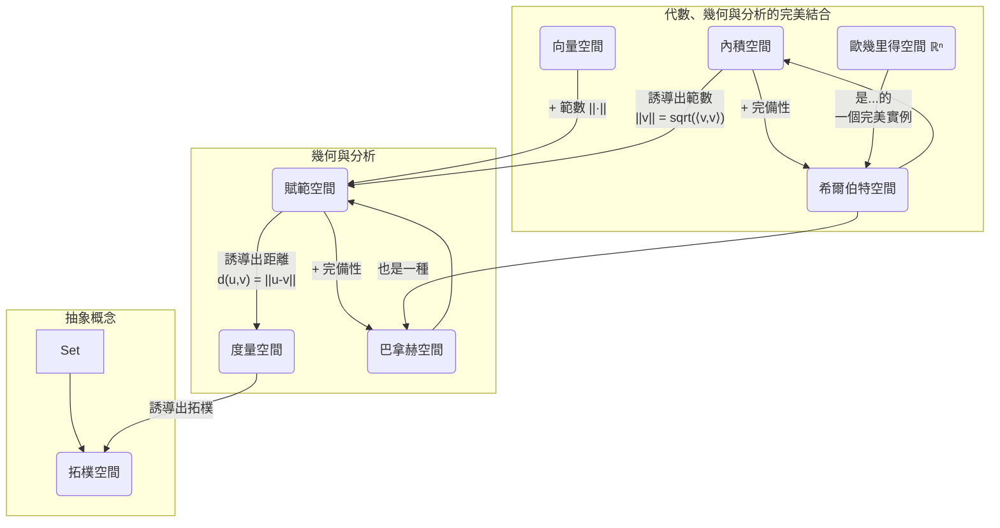

# 數學中的空間

* [AI Studio 對話錄](https://aistudio.google.com/app/prompts?state=%7B%22ids%22:%5B%221-AzkJuH6KQu8TYJ9fDL3cJZU73bwWHdC%22%5D,%22action%22:%22open%22,%22userId%22:%22111605452542833299008%22,%22resourceKeys%22:%7B%7D%7D&usp=sharing)

## Q: 從代數學的角度看，空間 Space 也有其代數結構嗎？空間可以分為哪些類別呢？

好的，同學，問得很好！這個問題非常核心，觸及了現代數學與許多科學領域的基礎。身為你的數學老師，我很高興你對這個問題有興趣，這表示你已經開始思考數學背後的抽象結構了。

我們用一個簡單直接的方式來回答你：

 **是的，從代數學的角度看，空間（Space）絕對可以有，而且經常有其代數結構！** 

但這裡有個關鍵要先弄清楚：「空間」這個詞在數學裡，比我們日常生活中說的「三維空間」要廣泛得多。數學家口中的「空間」，通常是指一個 **集合（Set）** ，再加上一些額外的 **結構（Structure）** 。這個「結構」可以是距離、角度、極限，當然，也可以是「代數結構」。

---

### 空間的代數結構是什麼？

我們先回想一下什麼是「代數結構」。代數結構的核心是 **「運算」** 。例如：

*    **群 (Group):**  集合裡有一種運算（例如：加法），滿足封閉性、結合律、有單位元素、有反元素。
*    **環 (Ring):**  集合裡有兩種運算（例如：加法和乘法），它們之間有一些規則（如分配律）。
*    **體 (Field):**  一種特別的環，除了加法的 0 之外，所有元素都有乘法反元素（可以做除法）。

那麼，一個帶有代數結構的空間是什麼樣子呢？最經典、對資工系學生也最重要的例子，就是  **向量空間 (Vector Space)** 。

#### 核心範例：向量空間 (Vector Space)

你可以把向量空間想像成一個「遊樂場」，這個遊樂場裡有兩種東西：

1.   **向量 (Vectors):**  這些是遊樂場裡的主要玩具。在你的程式世界裡，它可以是一個陣列 `[1, 2, 3]`，一張圖片的所有像素值，或是一個機器學習模型的權重參數。
2.   **純量 (Scalars):**  這些是調整玩具的「控制器」。通常是實數或複數。你可以用它來「放大」或「縮小」你的向量。

這個「遊樂場」規定了兩種基本的「玩法」（也就是代數運算）：

*    **向量加法 (Vector Addition):**  `v + w`。你可以把兩個向量加在一起，得到一個新的向量。例如：`[1, 2] + [3, 4] = [4, 6]`。這個加法運算滿足群的性質，所以向量集合在加法下形成一個「阿貝爾群 (Abelian Group)」。
*    **純量乘法 (Scalar Multiplication):**  `c * v`。你可以用一個純量去乘以一個向量，把它拉長或縮短。例如：`2 * [1, 2] = [2, 4]`。

一個集合只要能滿足這兩種運算，並遵守一些簡單的規則（像是結合律、分配律），它就是一個「向量空間」。

 **所以你看，向量空間就是一個同時擁有「空間」概念（點、方向、維度）和「代數結構」（向量加法、純量乘法）的完美結合。** 

在電腦科學裡，從電腦圖學（3D模型的座標變換）、機器學習（特徵向量的處理）到訊號處理（傅立葉轉換），幾乎所有東西都建立在向量空間的概念之上。

---

### 空間可以分為哪些類別呢？

數學家非常喜歡分類！他們會根據賦予一個集合 **什麼樣的額外結構** ，來把空間分成不同的類別。就像你可以把車子分成跑車、卡車、休旅車一樣，它們都是車，但功能和特性不同。

對資工系的學生來說，最重要的幾類空間是：

#### 1. 拓樸空間 (Topological Space)

*    **核心結構：**   **開集 (Open Sets)** ，用來定義「遠近」、「鄰近」、「連續」的概念。
*    **白話解釋：**  它不關心精確的距離或角度，只關心「連通性」和「連續性」。你可以把一個甜甜圈（Torus）捏成一個咖啡杯，在拓樸學家眼裡，它們是「同胚」的，因為它們都有一個「洞」。它們的「拓樸結構」是相同的。
*    **與資工的關聯：** 
    *    **網路拓樸：**  分析網路的連接方式，不管伺服器之間的實體距離多遠，只看它們是如何連接的。
    *    **數據分析與機器學習：**  在高維數據中，用來理解數據點的「叢集」和「流形」結構，例如 T-SNE 降維算法就利用了拓樸思想。

#### 2. 度量空間 (Metric Space)

*    **核心結構：**   **距離函數 (Distance Function / Metric)** ，`d(x, y)`，用來明確計算任意兩點之間的距離。
*    **白話解釋：**  這是我們最直觀的空間。你給它兩個點，它就能告訴你這兩個點有多遠。我們熟悉的三維歐幾里得空間 (Euclidean Space) 就是最經典的度量空間。
*    **與資工的關聯：** 
    *    **演算法：**  K-最近鄰演算法 (K-Nearest Neighbors, KNN) 就是在一個度量空間中，尋找離某個點最近的 K 個鄰居。
    *    **數據庫：**  搜尋「最相似」的圖片或文件，本質上就是在一個高維特徵空間中計算距離。

#### 3. 向量空間 (Vector Space)

*    **核心結構：**   **代數運算**  (向量加法和純量乘法)。
*    **白話解釋：**  我們前面提過了，這是一個充滿向量的空間，你可以在裡面做線性組合 (linear combination)。它是 **線性代數 (Linear Algebra)**  的主要研究對象。
*    **與資工的關聯：**  無所不在！電腦圖學、機器學習、密碼學、最佳化問題... 任何需要處理矩陣和向量的地方，都離不開它。

#### 這些空間的關係：

很重要的一點是，這些空間類型不是互斥的，而是可以層層疊加的！

*   一個 **向量空間** ，如果我們在上面定義一個「範數 (Norm)」（可以理解為向量的「長度」），它就可以變成一個 **度量空間** （因為兩點的距離可以定義為它們差向量的長度 `d(v, w) = ||v - w||`）。
*   一個 **度量空間** ，也必然是一個 **拓樸空間** （因為我們可以根據距離來定義「開集」：所有離某點距離小於 r 的點構成一個開集）。

所以，我們可以有一個階層關係：
 **向量空間 (有代數結構) -> (加上範數) -> 度量空間 (有距離) -> (只看鄰近關係) -> 拓樸空間 (有連續性)** 

例如，我們最熟悉的  **歐幾里得空間 (Euclidean Space, R³)** ，它 **同時** 是向量空間、度量空間和拓樸空間，擁有非常豐富的結構。

### 總結給資工大一的你：

1.   **空間不只是空間：**  在數學和資工領域，「空間」是一個 **集合** 加上 **額外結構** 。
2.   **代數結構賦予運算：**  當這個額外結構是「運算」（如加法、乘法）時，這個空間就有了 **代數結構** 。 **向量空間** 是你未來四年最需要掌握的例子。
3.   **不同結構，不同視角：** 
    *   想談論 **線性變換、座標系統**  -> 進入 **向量空間** 的世界。
    *   想計算 **相似度、誤差、距離**  -> 進入 **度量空間** 的世界。
    *   想分析 **連通性、網路結構、數據形狀**  -> 進入 **拓樸空間** 的世界。

理解這些不同的數學空間，就像是拿到了一副多功能的瑞士軍刀。面對一個複雜的程式或演算法問題時，你可以選擇最合適的「工具」（數學視角）來分析和解決它。

希望這樣的解釋能幫助你建立一個清晰的藍圖！未來你在線性代數、離散數學、演算法等課程中，會不斷地與這些「空間」打交道。

## Q: 能用嚴格的數學定義那些不同類型的空間嗎？

當然可以。同學，你這種追根究柢的精神非常好！從直觀理解進入到嚴格的數學定義，是從「使用數學」邁向「理解數學本質」的關鍵一步。這些定義就像是程式語言的規格書，精確、沒有歧義。

我們就來逐一拆解這些空間的「原始碼」。

在開始之前，我們要先定義最基本的建構模塊：

---

### 基礎：集合 (Set)

所有數學空間的基礎都是 **集合** 。

*    **定義：**  一個集合 (Set) 是一個由明確、相異的物件所組成的總體。這些物件被稱為集合的 **元素 (Elements)** 。
*    **符號：**  我們通常用大寫字母如 `X` 來表示集合。`x ∈ X` 表示 `x` 是集合 `X` 的一個元素。

---

### 1. 拓樸空間 (Topological Space)

這是最廣義、最抽象的空間。它只定義了「鄰近」這個概念，讓我們可以討論「連續」、「極限」等。

*    **嚴格定義：** 
    一個拓樸空間是一個有序對 `(X, τ)`，其中 `X` 是一個集合，而 `τ` 是 `X` 的一系列 **子集**  (subsets) 的集合，並且 `τ` 滿足以下三個公理 (Axioms)：
    1.  空集合 `∅` 和集合 `X` 本身都屬於 `τ`。
        *   `∅ ∈ τ` and `X ∈ τ`
    2.  `τ` 中任意多個成員的聯集 (Union) 仍然在 `τ` 中。
        *   If `Uᵢ ∈ τ` for all `i` in some index set `I`, then `⋃ᵢ Uᵢ ∈ τ`.
    3.  `τ` 中有限多個成員的交集 (Intersection) 仍然在 `τ` 中。
        *   If `U₁`, `U₂`, ..., `Uₙ` are in `τ`, then `U₁ ∩ U₂ ∩ ... ∩ Uₙ ∈ τ`.

*    **名詞解釋：** 
    *   `X`：底層的點集合。
    *   `τ`：被稱為 `X` 上的一個 **拓樸 (Topology)** 。
    *   `τ` 中的成員：被稱為該拓樸空間的 **開集 (Open Sets)** 。

*    **核心思想：** 
    這個定義本身並沒有告訴我們「開集」長什麼樣子，它只是規定了「什麼樣的集合 **可以被稱為** 開集」。只要你指定的一系列子集滿足這三條規則，它們就構成了一個合法的拓樸，從而定義了一個拓樸空間。這賦予了它極大的靈活性。

---

### 2. 度量空間 (Metric Space)

度量空間比拓樸空間更具體，它引入了「距離」的概念。

*    **嚴格定義：** 
    一個度量空間是一個有序對 `(X, d)`，其中 `X` 是一個集合，而 `d` 是一個函數，稱為 **度量 (Metric)**  或 **距離函數 (Distance Function)** ，`d: X × X → ℝ`，它對於 `X` 中所有的 `x, y, z` 元素，滿足以下四個公理：
    1.   **非負性 (Non-negativity):**  `d(x, y) ≥ 0`
    2.   **同一性 (Identity of indiscernibles):**  `d(x, y) = 0` 若且唯若 `x = y`
    3.   **對稱性 (Symmetry):**  `d(x, y) = d(y, x)`
    4.   **三角不等式 (Triangle Inequality):**  `d(x, z) ≤ d(x, y) + d(y, z)`

*    **名詞解釋：** 
    *   `X`：底層的點集合。
    *   `d(x, y)`：一個實數，代表點 `x` 和點 `y` 之間的距離。

*    **核心思想：** 
    只要一個函數能滿足這四個關於「距離」的直觀要求（距離不能是負的、自己到自己的距離是零、A到B和B到A的距離一樣、走折線不會比走直線更近），它就是一個合法的度量。

---

### 3. 向量空間 (Vector Space)

向量空間的核心是代數結構，它定義了「線性組合」。

*    **嚴格定義：** 
    一個在 **體 (Field)**  `F` 上的向量空間是一個集合 `V`，它配備了兩種運算：
    1.   **向量加法 (Vector Addition):**  `+ : V × V → V`
    2.   **純量乘法 (Scalar Multiplication):**  `· : F × V → V`

    這兩種運算對於 `V` 中所有的向量 `u, v, w` 和 `F` 中所有的純量 `a, b`，必須滿足以下公理：

     **A) 向量加法的公理 (使得 `(V, +)` 構成一個阿貝爾群 Abelian Group):** 
    1.   **結合律 (Associativity):**  `(u + v) + w = u + (v + w)`
    2.   **交換律 (Commutativity):**  `u + v = v + u`
    3.   **單位元素 (Identity element):**  存在一個 **零向量 0**  ∈ `V`，使得對於所有 `v` ∈ `V`，`v + 0 = v`。
    4.   **反元素 (Inverse element):**  對於每一個 `v` ∈ `V`，都存在一個反向量 `-v` ∈ `V`，使得 `v + (-v) = 0`。

     **B) 純量乘法的公理 (描述純量與向量的交互):** 
    5.   **純量乘法對向量加法的分配律:**  `a · (u + v) = a · u + a · v`
    6.   **純量乘法對純量加法的分配律:**  `(a + b) · v = a · v + b · v`
    7.   **純量乘法與純量域乘法的相容性:**  `a · (b · v) = (ab) · v`
    8.   **純量乘法的單位元素:**  `1 · v = v`，其中 `1` 是體 `F` 的乘法單位元素。

*    **名詞解釋：** 
    *   `V`： **向量 (Vectors)**  的集合。
    *   `F`： **純量 (Scalars)**  的集合，它本身必須是一個 **體 (Field)** （例如：實數 `ℝ` 或複數 `ℂ`）。

---

### 空間之間的嚴格關係

現在我們可以更嚴格地定義它們之間的層級關係。

#### 從度量空間到拓樸空間

任何一個度量空間 `(X, d)` 都可以 **自然地誘導 (induce)**  出一個拓樸空間 `(X, τ)`。

1.  首先，我們定義一個 **開球 (Open Ball)** ：對於任意點 `x ∈ X` 和任意半徑 `r > 0`，以 `x` 為中心、`r` 為半徑的開球是集合 `B(x, r) = {y ∈ X | d(x, y) < r}`。
2.  然後，我們定義一個子集 `U ⊆ X` 是 **開集** ，若且唯若對於 `U` 中的每一個點 `x`，都存在一個半徑 `r > 0`，使得以 `x` 為中心的開球 `B(x, r)` 完全包含在 `U` 中 (`B(x, r) ⊆ U`)。
3.  所有這樣定義的開集所構成的集合 `τ`，可以被證明滿足拓樸空間的三個公理。因此，`(X, τ)` 是一個拓樸空間。

#### 從向量空間到度量空間 (透過範數)

一個向量空間 `V` 自身不直接是度量空間，但如果我們為它定義一個 **範數 (Norm)** ，它就可以成為度量空間。

1.  一個 **範數** 是一個函數 `||·|| : V → ℝ`，對於所有 `v ∈ V` 和純量 `a ∈ F`，滿足：
    *   `||v|| ≥ 0` (非負性)
    *   `||v|| = 0` 若且唯若 `v = 0` (同一性)
    *   `||a · v|| = |a| · ||v||` (絕對齊次性)
    *   `||u + v|| ≤ ||u|| + ||v||` (三角不等式)
    一個帶有範數的向量空間稱為 **賦範向量空間 (Normed Vector Space)** 。
2.  任何一個賦範向量空間 `(V, ||·||)` 都可以誘導出一個度量空間 `(V, d)`，只需定義距離函數為：
    `d(u, v) = ||u - v||`
    這個由範數誘導出的 `d` 可以被證明滿足度量空間的四個公理。

### 總結

| 空間類型 | 核心結構 | 嚴格定義 | 賦予的能力 |
| :--- | :--- | :--- | :--- |
|  **拓樸空間**  | `(X, τ)` 一個集合和一組開集 | 滿足聯集、交集公理的子集族 | 討論 **連續性、極限、連通性**  |
|  **度量空間**  | `(X, d)` 一個集合和一個距離函數 | 滿足非負、對稱、三角不等式等公理 | 精確計算任意兩點間的 **距離**  |
|  **向量空間**  | `(V, F, +, ·)` 向量集、純量體和兩種運算 | 滿足向量加法和純量乘法的八個公理 | 進行 **線性組合、座標變換**  |

希望這些嚴格的定義能讓你更深刻地理解數學家是如何建構這些抽象卻極其有用的概念。剛開始接觸可能會覺得枯燥，但當你意識到整個線性代數、微積分甚至機器學習的理論都建立在這些堅實的公理之上時，你會感受到數學的強大與優美。

## Q: wikipeida 中還有很多類型的空間 ...，請選取其中重要的空間寫出其數學定義

同學，你問到點上了！這份清單就像是數學家們的「動物園」，裡面有各種各樣的「空間生物」，每一個都有其獨特的「基因」（結構）。一個初學者看到肯定會眼花撩亂。

身為你的老師，我的任務就是帶你去看這個動物園裡最重要的幾個「明星物種」。我們會看到，這些空間往往是通過在一個已有的、更簡單的空間上 **增加更多、更強的結構** 而誕生的。

我為你挑選了對未來資工領域（特別是理論、圖學、機器學習、數據科學）最重要的幾個空間，並按照它們結構的遞進關係來介紹。

---

### 我們的學習路徑

我們將沿著幾條主線來探索：

1.   **代數與幾何的路徑（核心中的核心）：** 
    *   `Vector Space` (向量空間) - 我們熟悉的基礎
    *   `Inner Product Space` (內積空間) - 賦予向量空間「角度」和「長度」
    *   `Euclidean Space` (歐幾里得空間) - 我們最直觀的三維空間的推廣
2.   **分析學的路徑（處理極限與無窮）：** 
    *   `Normed Space` (賦範空間) - 嚴格定義向量的「長度」
    *   `Banach Space` (巴拿赫空間) - 一個「完備」的賦範空間
    *   `Hilbert Space` (希爾伯特空間) - 一個「完備」的內積空間，功能最強大
3.   **機率與測度的路徑（處理「大小」與「可能性」）：** 
    *   `Measure Space` (測度空間) - 賦予集合一種測量「大小」的方法
    *   `Probability Space` (機率空間) - 一種總大小為 1 的特殊測度空間
4.   **幾何變換的路徑（圖學相關）：** 
    *   `Affine Space` (仿射空間) - 一個「忘記了原點」的向量空間

---

### 1. 內積空間 (Inner Product Space)

*    **一句話總結：**  一個可以計算向量之間 **角度** 和 **投影** 的向量空間。
*    **嚴格數學定義：** 
    一個在體 `F` (通常是實數 `ℝ` 或複數 `ℂ`) 上的內積空間是一個向量空間 `V`，以及一個稱為 **內積 (Inner Product)**  的函數 `⟨·, ·⟩ : V × V → F`，它滿足以下公理（對於所有 `x, y, z ∈ V` 和 `a ∈ F`）：
    1.   **共軛對稱性 (Conjugate symmetry):** 
        `⟨x, y⟩ = overline(⟨y, x⟩)`
        (如果體是實數 `ℝ`，這就簡化為 **對稱性**  `⟨x, y⟩ = ⟨y, x⟩`)
    2.   **第一變數的線性 (Linearity in the first argument):** 
        `⟨ax + y, z⟩ = a⟨x, z⟩ + ⟨y, z⟩`
    3.   **正定性 (Positive-definiteness):** 
        `⟨x, x⟩ ≥ 0`，且 `⟨x, x⟩ = 0` 若且唯若 `x = 0`。
*    **與資工的關聯與重要性：** 
    這是 **線性代數** 最精華的部分。有了內積，我們才能定義：
    *    **正交 (Orthogonality):**  如果 `⟨v, w⟩ = 0`，則向量 `v` 和 `w` 正交（垂直）。這在訊號處理（傅立葉級數）、數據壓縮（JPEG）中至關重要。
    *    **投影 (Projection):**  將一個向量投影到另一個向量上。這是 **最小二乘法 (Least Squares)**  的基礎，廣泛用於迴歸分析和機器學習。
    *    **長度 (Norm):**  向量 `v` 的長度可以被誘導出來，定義為 `||v|| = sqrt(⟨v, v⟩)`。

---

### 2. 賦範空間 (Normed Space / Normed Vector Space)

*    **一句話總結：**  一個可以嚴格定義每個向量 **長度** 的向量空間。
*    **嚴格數學定義：** 
    一個賦範空間是一個有序對 `(V, ||·||)`，其中 `V` 是一個向量空間，而 **範數 (Norm)**  是一個函數 `||·|| : V → ℝ`，滿足以下公理（對於所有 `x, y ∈ V` 和 `a ∈ F`）：
    1.   **正定性 (Positive-definiteness):**  `||x|| ≥ 0`，且 `||x|| = 0` 若且唯若 `x = 0`。
    2.   **絕對齊次性 (Absolute homogeneity):**  `||ax|| = |a| ||x||`。
    3.   **三角不等式 (Triangle inequality):**  `||x + y|| ≤ ||x|| + ||y||`。
*    **與資工的關聯與重要性：** 
    *    **注意：**  任何內積空間都可以自然地成為一個賦範空間（`||v|| = sqrt(⟨v, v⟩)`），但反之不成立！賦範空間更廣義。
    *    **機器學習：**  在最佳化問題中，我們使用範數來定義 **損失函數 (Loss Function)**  和 **正規化項 (Regularization)** ，例如 L1 範數和 L2 範數，用來防止模型過擬合。
    *    **距離的來源：**  任何賦範空間都可以變成一個 **度量空間** ，只要定義距離 `d(x, y) = ||x - y||`。

---

### 3. 歐幾里得空間 (Euclidean Space)

*    **一句話總結：**  我們最熟悉的、有限維度的、帶有標準內積的實向量空間。
*    **嚴格數學定義：** 
    `n` 維歐幾里得空間，表示為 `ℝⁿ`，是一個集合，其元素是 `n` 元實數組 `x = (x₁, x₂, ..., xₙ)`。它是一個 **內積空間** ，其標準內積（也稱為點積）定義為：
    `⟨x, y⟩ = x · y = ∑ᵢ xᵢyᵢ = x₁y₁ + x₂y₂ + ... + xₙyₙ`
    由該內積誘導出的範數稱為歐幾里得範數：`||x|| = sqrt(∑ᵢ xᵢ²)`。
    由該範數誘導出的距離稱為歐幾里得距離：`d(x, y) = ||x - y|| = sqrt(∑ᵢ (xᵢ - yᵢ)²)`。
*    **與資工的關聯與重要性：** 
    *   電腦圖學、機器人學、物理模擬的數學基礎。
    *   數據科學中，數據點常常被表示為 `ℝⁿ` 空間中的一個向量（特徵向量）。

---

### 4. 巴拿赫空間 (Banach Space)

*    **一句話總結：**  一個「沒有漏洞」的賦範空間。
*    **嚴格數學定義：** 
    一個巴拿赫空間是一個 **完備 (Complete)**  的賦範向量空間。
     **完備性 (Completeness)**  的意思是：空間中任何一個 **柯西序列 (Cauchy Sequence)**  都會收斂到 **該空間內** 的一點。
    *    **柯西序列：**  一個序列 `(x₁, x₂, ...)`，其元素隨著序列的推進會無限地彼此靠近。直觀上，這個序列「看起來應該要收斂」。
*    **與資工的關聯與重要性：** 
    *   這是從有限維進入無限維世界的第一步。很多 **函數空間 (Function Space)** ，例如連續函數構成的空間，都是巴拿赫空間。
    *   完備性保證了 **極限運算** 的良好行為。當你用迭代法求解一個問題時（例如梯度下降），完備性保證了如果你的解序列看起來收斂了，那麼它的極限點確實存在於你的解空間中，而不是一個「不存在的點」。

---

### 5. 希爾伯特空間 (Hilbert Space)

*    **一句話總結：**  終極形態——一個既有完美幾何結構（內積），又有完美分析結構（完備）的向量空間。
*    **嚴格數學定義：** 
    一個希爾伯特空間是一個 **完備 (Complete)**  的 **內積空間** 。
*    **與資工的關聯與重要性：** 
    *    **關係圖：** 
        `Hilbert Space` => `Banach Space` (因為內積可以誘導範數)
        `Hilbert Space` => `Inner Product Space` (根據定義)
    *    **機器學習：**   **支持向量機 (SVM)**  中的 **核方法 (Kernel Trick)**  的理論基礎就在於將數據映射到一個高維甚至無限維的希爾伯特空間中，使其變得線性可分。
    *    **訊號處理：**  傅立葉分析的舞台。任何合理的訊號（函數）都可以被分解為一系列正交基函數（如 sin 和 cos）的線性組合，這個舞台就是希爾伯特空間 `L²`。
    *    **量子計算：**  量子位元 (Qubit) 的狀態是在一個二維複希爾伯特空間 `ℂ²` 中描述的。

---

### 6. 機率空間 (Probability Space)

*    **一句話總結：**  一個用來數學化描述隨機試驗所有可能結果的空間。
*    **嚴格數學定義：** 
    一個機率空間是一個三元組 `(Ω, F, P)`，其中：
    1.   **樣本空間 (Sample Space) `Ω`：**  一個非空集合，其元素是所有可能的 **結果 (outcomes)** 。
    2.   **事件空間 (Event Space) `F`：**  `Ω` 的某些子集構成的集合，它必須是一個  **σ-代數 (σ-algebra)** ，滿足：
        *   `Ω ∈ F`
        *   如果 `A ∈ F`，則其補集 `Aᶜ ∈ F`。
        *   如果有一系列可數的事件 `A₁, A₂, ...` 都在 `F` 中，那麼它們的聯集 `⋃ᵢ Aᵢ` 也在 `F` 中。
    3.   **機率測度 (Probability Measure) `P`：**  一個函數 `P : F → [0, 1]`，滿足：
        *   `P(Ω) = 1`。
        *   對於一系列可數的、互不相交的事件 `A₁, A₂, ...`，有 `P(⋃ᵢ Aᵢ) = ∑ᵢ P(Aᵢ)`。
*    **與資工的關聯與重要性：** 
    *   所有機率論和隨機過程的基礎。
    *    **機器學習與AI：**  貝氏統計、馬可夫鏈、強化學習等都建立在機率空間的公理之上。
    *    **演算法：**  隨機化演算法的分析。

---

### 7. 仿射空間 (Affine Space)

*    **一句話總結：**  一個只有「相對位置」概念，沒有「絕對原點」的幾何空間。
*    **嚴格數學定義：** 
    一個仿射空間 `(A, V, +)` 包含：
    1.  一個 **點集**  `A`。
    2.  一個與之關聯的 **向量空間**  `V`。
    3.  一個 **加法運算**  `+ : A × V → A`，它將一個點和一個向量映射到另一個點。

    此運算滿足：
    1.  對於任意點 `p ∈ A`，`p + 0 = p` (0 是 V 的零向量)。
    2.  `(p + v) + w = p + (v + w)` (結合律)。
    3.  對於任意兩點 `p, q ∈ A`， **存在唯一** 一個向量 `v ∈ V`，使得 `p + v = q`。這個唯一的向量記為 `v = q - p`。
*    **與資工的關聯與重要性：** 
    *    **電腦圖學：**  這是描述幾何變換最自然的語言。一個物體的平移、旋轉、縮放，都是 **仿射變換** 。在仿射空間中，我們關心的是點之間的相對關係（向量 `q-p`），而不是每個點相對於某個特殊原點的絕對座標。這使得坐標系的變換變得非常優雅。

### 總結表

| 空間名稱 | 核心結構 | 關鍵思想 | 資工應用領域 |
| :--- | :--- | :--- | :--- |
|  **內積空間**  | 向量空間 + 內積 `⟨·,·⟩` | 引入角度、正交、投影 | 最小二乘法、訊號分解 |
|  **賦範空間**  | 向量空間 + 範數 `||·||` | 引入長度、大小 | 機器學習損失函數、正規化 |
|  **歐幾里得空間**  | `ℝⁿ` + 標準點積 | 有限維、直觀的幾何空間 | 電腦圖學、物理模擬、數據分析 |
|  **巴拿赫空間**  | 賦範空間 + 完備性 | 保證極限存在於空間內 | 泛函分析、最佳化理論 |
|  **希爾伯特空間**  | 內積空間 + 完備性 | 完美的幾何與分析結構 | SVM (核方法)、傅立葉分析、量子計算 |
|  **機率空間**  | `(Ω, F, P)` 樣本、事件、機率 | 隨機性的數學公理化 | AI、機器學習、隨機演算法 |
|  **仿射空間**  | 點集 + 向量空間 | 只有相對位置，沒有原點 | 電腦圖學中的幾何變換 |

別被這些定義嚇到。你不需要立刻記住所有細節。重要的是理解它們之間的 **層級和關聯** ：從一個簡單的結構，通過增加新的規則（公理），我們可以得到一個功能更強大、結構更豐富的空間，用來解決更複雜的問題。

這份地圖在你未來的學習中會非常有用。當你修線性代數、機率論、最佳化方法等課程時，可以隨時回來查閱，你會發現這些抽象的概念正是那些實用技術背後的堅實骨架。

## Q: 它們(這些空間）之間的層級和關聯，請解說之

好的，這正是所有知識點串連起來最關鍵的一步！理解了它們之間的層級和關聯，你就等於擁有了一張數學世界的「科技樹」地圖。

我們不用枯燥的條列式，而是用一個「 **升級與進化** 」的視角來看待這些空間。想像我們從最原始、最基本的物件開始，一步步為它添加裝備（結構），讓它進化成功能更強大的物種。

---

### 起點：混沌的「點」之集合 (Set)

我們的宇宙始於一個最基本的  **集合 (Set)** ，裡面只是一堆離散的「點」，我們對它們一無所知，不知道它們誰離誰近，也不知道如何操作它們。它就是一袋彈珠。

---

### 分支一：賦予「形狀」與「遠近」—— 拓樸與度量之路

這條路徑關心的是空間的幾何與形狀。

#### 第1級進化：拓樸空間 (Topological Space)

*    **新增裝備：**   **拓樸結構 `τ` (一組開集)** 
*    **獲得能力：**  我們第一次擁有了「 **鄰近** 」和「 **連續** 」的概念。我們雖然不知道兩點的精確距離，但可以描述「一個點在另一個點的附近」或者「一個變換是平滑連續的」。
*    **比喻：**  彈珠被放進了一塊可以任意拉伸的橡膠墊裡。我們可以討論哪些彈珠聚成一堆，但拉伸橡膠墊不會改變這種「聚集」關係。

#### 第2級進化：度量空間 (Metric Space)

*    **新增裝備：**   **距離函數 `d` (一個尺子)** 
*    **獲得能力：**  我們現在可以精確測量 **任意兩點間的距離** 。這是一個巨大的升級。
*    **比喻：**  橡膠墊換成了一塊堅硬的木板，我們有了一把尺子，可以量出任意兩個彈珠的距離。

 **💡 關鍵關聯 #1：** 
>  **度量空間 `⊂` 拓樸空間** 
> 任何一個度量空間 **必定** 是一個拓樸空間。因為一旦你有了「距離」這個強大的工具，你自然就能定義出「鄰近」（例如：所有距離我小於1的點），從而誘導出一個拓樸結構。但反過來不成立，有些拓樸空間是無法用一個合理的距離函數來描述的。

---

### 分支二：賦予「運算」與「結構」—— 代數之路

這條路徑關心的是空間的代數操作。

#### 第1級進化：向量空間 (Vector Space)

*    **新增裝備：**   **向量加法 `+` 和純量乘法 `·`** 
*    **獲得能力：**  我們可以在空間中進行 **線性組合** 。我們可以把點（現在稱為向量）相加，或者將它們拉長縮短。這讓我們擁有了「 **方向** 」和「 **維度** 」的概念。
*    **比喻：**  我們發明了兩套規則來玩這些彈珠：如何將兩顆彈珠「疊加」成一顆新的，以及如何「複製」一顆彈珠任意倍。整個線性代數就是圍繞這套規則展開的。

---

### 偉大的融合：讓代數空間擁有幾何性質

現在，最激動人心的部分來了。如果我們把「代數之路」進化出的向量空間，再用「幾何之路」的裝備來強化它呢？

#### 第2級融合進化：賦範空間 (Normed Space)

*    **基礎物種：**  向量空間
*    **新增裝備：**   **範數 `||·||` (向量的長度)** 
*    **獲得能力：**  我們不僅可以對向量做運算，還可以 **測量每個向量自身的「長度」或「大小」** 。
*    **💡 關鍵關聯 #2：** 
    >  **賦範空間 `⊂` 度量空間** 
    > 任何一個賦範空間 **必定** 是一個度量空間。因為一旦你能測量每個向量的長度，你就可以定義兩點 `u, v` 之間的距離為它們差向量的長度：`d(u, v) = ||u - v||`。

#### 第3級融合進化：內積空間 (Inner Product Space)

*    **基礎物種：**  向量空間
*    **新增裝備：**   **內積 `⟨·,·⟩` (角度和投影的工具)** 
*    **獲得能力：**  這是最強大的幾何裝備！我們不僅有長度，還能計算兩個向量之間的 **夾角** ，定義什麼是 **垂直（正交）** ，以及做 **投影** 。
*    **💡 關鍵關聯 #3：** 
    >  **內積空間 `⊂` 賦範空間** 
    > 任何一個內積空間 **必定** 是一個賦範空間。因為一旦有了內積，你就可以自然地定義向量 `v` 的長度為 `||v|| = sqrt(⟨v, v⟩)`。這個由內積誘導出的範數，自動滿足範數的所有公理。

---

### 最終升級：應對無窮的「完備性」

前面所有的空間，在處理無限序列的極限時，可能會出現「漏洞」。就像有理數序列 `3, 3.1, 3.14, ...` 的極限 `π` 跑到了有理數集合的外面。完備性就是把這些「漏洞」都補上。

*    **賦範空間 + 完備性 = 巴拿赫空間 (Banach Space)** 
*    **內積空間 + 完備性 = 希爾伯特空間 (Hilbert Space)** 

 **💡 關鍵關聯 #4：** 
>  **希爾伯特空間 `⊂` 巴拿赫空間** 
> 任何一個希爾伯特空間 **必定** 是一個巴拿赫空間。因為希爾伯特空間是完備的內積空間，其內積誘導出的範數使它也成為了一個完備的賦範空間。希爾伯特空間是功能最齊全、性質最優美的空間之一。

---

### 總結：空間的層級關係圖

我們可以畫出這樣一張清晰的「進化圖」（箭頭代表「是...的一種特例」）：

 **對這張圖的解讀：** 

*    **核心鏈條：**  右下角是最核心、功能最強大的鏈條。 **歐幾里得空間** 是我們最熟悉、性質最好的具體例子，它是一個（有限維） **希爾伯特空間** 。而希爾伯特空間是一種特殊的 **巴拿赫空間** ，巴拿赫空間是一種特殊的 **賦範空間** ，賦範空間是一種特殊的 **度量空間** ，度量空間又是一種特殊的 **拓樸空間** 。
*    **結構的增加：**  從右往左，結構越來越豐富。從拓樸空間（只有遠近）到度量空間（有了距離），再到賦範空間（有了長度），最後到內積空間（有了角度）。
*    **完備性的作用：**  希爾伯特空間和巴拿赫空間是它們的「前輩」（內積空間和賦範空間）在加入了「完備性」這個屬性後得到的「Plus升級版」，專門用來處理分析學中的極限問題。

至於  **仿射空間**  和  **機率空間** ：
*    **仿射空間**  是向量空間的「兄弟」。你可以把它看作是一個向量空間，但故意「忘記」了哪一個是原點。它專注於點的相對位置和變換，在電腦圖學中非常有用。
*    **機率空間**  則來自另一條完全不同的進化路線，它是在一個集合上賦予「測度」（測量大小或機率）的結構，與距離、角度這些概念無關。

希望這張「進化地圖」能幫助你清晰地理解這些數學空間之間的深刻聯繫！

## Q: 最常見的空間，應該是歐氏空間，其特性是什麼呢？這個空間中有什麼重要定理呢？

問得非常好！如果說我們之前談論的各種空間是不同功能的「交通工具」（跑車、卡車、飛機），那麼 **歐幾里得空間 (Euclidean Space)**  就是我們每天都在開的、最熟悉可靠的「家庭房車」。它是我們幾乎所有直覺的來源，也是你在資工領域最先要徹底搞懂的數學舞台。

---

### 歐氏空間的特性是什麼？

我們可以把歐氏空間 `ℝⁿ` 的特性想像成一份「產品規格書」。它之所以如此好用，是因為它擁有幾乎所有我們期望的優良性質，堪稱「空間中的瑞士刀」。

#### 規格書：歐幾里得空間 `ℝⁿ`

1.   **基本結構：一個完美的向量空間 (Vector Space)** 
    *    **特性：**  空間中的每一個點都可以看作一個從原點出發的向量 `v = (x₁, x₂, ..., xₙ)`。你可以對這些向量進行 **向量加法** 和 **純量乘法** ，並且所有運算都表現得非常良好（滿足8條公理）。
    *    **白話解釋：**  你可以在這個空間裡自由地進行平移、縮放、組合各種向量，建立座標系。這是所有電腦圖學和物理模擬的基礎。

2.   **核心引擎：標準內積 (Standard Inner Product / Dot Product)** 
    *    **特性：**  這是歐氏空間最核心的裝備。對於兩個向量 `u` 和 `v`，它們的點積 `u · v` 是一個純量。這個簡單的運算賦予了空間豐富的幾何結構。
    *    **白話解釋：**  有了點積，我們就從一個只能做代數運算的向量空間，進化到了一個可以 **測量幾何** 的空間。它讓我們能定義：
        *    **長度 (Length / Norm):**  向量 `v` 的長度 `||v||` 就是 `sqrt(v · v)`。這就是 **畢氏定理** 的直接應用！`||(3, 4)|| = sqrt(3² + 4²) = 5`。
        *    **角度 (Angle):**  兩個向量 `u` 和 `v` 之間的夾角 `θ` 可以用 `cos(θ) = (u · v) / (||u|| ||v||)` 來計算。
        *    **正交 (Orthogonality):**  當 `u · v = 0` 時，兩個向量互相垂直。這是建構「直角座標系」的基礎。

3.   **完備的幾何與分析性質** 
    *    **特性：** 
        *   它是一個 **希爾伯特空間 (Hilbert Space)** ，這意味著它既有完美的內積結構，又是 **完備 (Complete)**  的。
        *    **完備性** 的意思是，空間中沒有「漏洞」。任何看起來應該要收斂的點序列，其極限點都確實存在於這個空間中。
    *    **白話解釋：**  你可以放心地在這個空間裡進行微積分和極限運算，不用擔心結果會「跑到」空間外面去。這對於所有最佳化演算法（例如機器學習中的梯度下降）至關重要。

4.   **最關鍵的實用特性：有限維度 (Finite-Dimensional)** 
    *    **特性：**  對於任何 `n` 維歐氏空間 `ℝⁿ`，你總是可以找到一組 `n` 個線性獨立的向量（稱為一組 **基 (Basis)** ），使得空間中任何一個向量都可以表示為這組基的唯一線性組合。最簡單的基就是標準基，例如 `ℝ³` 中的 `(1,0,0)`, `(0,1,0)`, `(0,0,1)`。
    *    **白話解釋：**  這是歐氏空間 **適合電腦處理** 的根本原因。無論多複雜的向量，最終都可以用 `n` 個數字（座標）來精確表示和儲存。電腦最擅長的就是處理這種由固定數量數字組成的陣列。這與那些需要無限個基向量的「函數空間」形成了鮮明對比。

 **總結特性：**  歐氏空間 `ℝⁿ` 是一個 **有限維、完備的內積空間** 。它完美地融合了代數的線性結構和我們直觀的幾何概念（長度、距離、角度），使其成為一個理想的、可計算的數學模型。

---

### 這個空間中有什麼重要定理呢？

在歐氏空間這個完美的「遊樂場」裡，數學家們發現了許多威力強大的定理。這些定理就像是物理世界中的「萬有引力定律」一樣，是我們進行計算和推理的基石。對資工學生來說，以下幾個是你必須知道的：

#### 1. 畢氏定理 (Pythagorean Theorem)

*    **內容：**  在一個直角三角形中，兩條直角邊的長度平方和等於斜邊的長度平方。在歐氏空間中，如果兩個向量 `u` 和 `v` 正交 (`u · v = 0`)，則 `||u + v||² = ||u||² + ||v||²`。
*    **重要性：** 
    *   這是 **歐氏距離** 公式的來源。
    *   它是所有「長度」概念的基礎。
    *    **資工應用：**  任何需要計算兩點間距離的場景，從遊戲引擎中的碰撞檢測，到 K-最近鄰演算法中數據點的距離計算。

#### 2. 柯西-施瓦茨不等式 (Cauchy-Schwarz Inequality)

*    **內容：**  對於任意兩個向量 `u` 和 `v`，`|u · v| ≤ ||u|| ||v||`。
*    **重要性：** 
    *   這個不等式保證了我們用點積計算角度的公式 `cos(θ) = (u · v) / (||u|| ||v||)` 是有意義的（因為它確保了右邊的值總是在 -1 和 1 之間）。
    *   它給出了兩個向量「對齊」程度的上限。
    *    **資工應用：**  這是 **餘弦相似度 (Cosine Similarity)**  的理論基礎。在自然語言處理和推薦系統中，我們把文件或使用者轉換成高維向量，用餘弦相似度來判斷它們的相似性，這背後就是柯西-施瓦茨不等式在發揮作用。

#### 3. 格拉姆-施密特正交化過程 (Gram-Schmidt Process)

*    **內容：**  這不是一個定理，而是一個 **演算法** 。它告訴我們，如何從任意一組線性獨立的向量出發，建構出一組新的、標準正交（兩兩垂直且長度為1）的基向量，且這兩組基能張成同一個子空間。
*    **重要性：** 
    *   它證明了任何有限維歐氏子空間都存在一組標準正交基。
    *   標準正交基可以極大地簡化計算，因為投影和座標計算會變得非常簡單。
    *    **資工應用：**  在數值計算中用於矩陣的  **QR 分解** ，這在求解線性方程組和計算特徵值時非常重要。在電腦圖學中，用來為物體建立一個方便計算的局部座標系。

#### 4. 對稱矩陣的光譜定理 (Spectral Theorem for Symmetric Matrices)

*    **內容：**  對於歐氏空間 `ℝⁿ` 中的任何一個對稱矩陣 `A` (`A = Aᵀ`)，存在一組由 `A` 的特徵向量構成的標準正交基，並且 `A` 的所有特徵值都是實數。
*    **重要性：** 
    *   這是 **應用線性代數中最核心的定理之一** 。它告訴我們，對稱矩陣所代表的線性變換，可以被完美地分解為沿著一組互相垂直的軸進行的拉伸/壓縮。
    *    **資工應用：**  這是 **主成分分析 (Principal Component Analysis, PCA)**  的數學基石。PCA 是機器學習中最重要的降維算法，它通過找到數據協方差矩陣（一個對稱矩陣）的特徵向量，來找出數據中「最重要」的變化方向，從而用更少的維度來表示數據。

### 給資工學生的總結

把 **歐氏空間 `ℝⁿ`**  當作你的 **預設操作系統** 。它穩定、可靠、功能齊全。

*   它的 **特性** （向量空間、內積、有限維）讓它成為一個 **適合電腦處理** 的理想模型。
*   它的 **重要定理** （畢氏定理、柯西-施瓦茨、光譜定理等）為你提供了強大的 **演算法工具箱** ，讓你能夠解決從圖學、數據分析到機器學習的各種實際問題。

你未來在線性代數課程中學到的大部分內容，都是在探索這個空間的奇妙之處。好好掌握它，你通往 Computer Science 的數學之路就成功了一大半。
